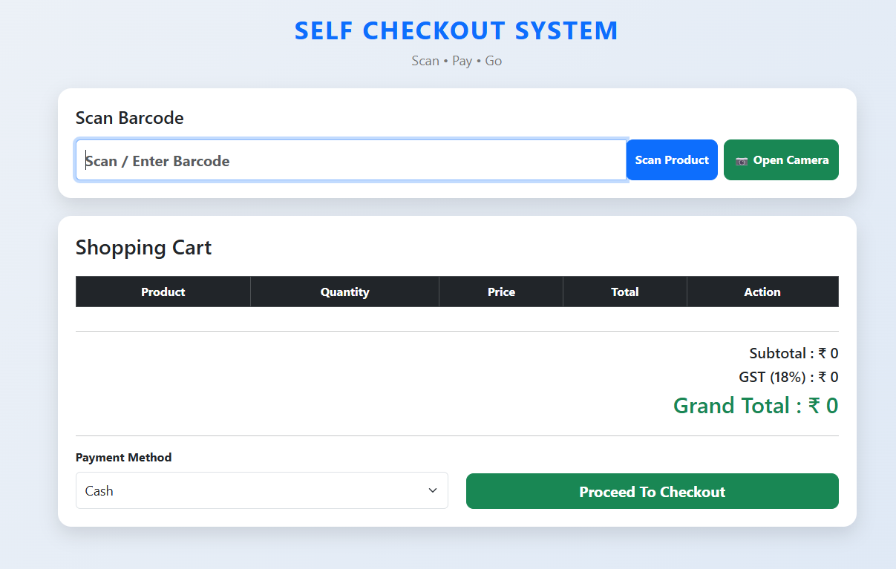

# 🛒 Self Checkout System

<p align="center">


</p>

---

## 📖 About

The **Self Checkout System** is a full-stack retail checkout application built using **Spring Boot**, **Thymeleaf**, and **MySQL**. It simulates a modern supermarket self-checkout kiosk where customers can scan products using either **manual barcode entry** or the **device camera**, manage their shopping cart, complete payments, and generate printable receipts.

The project demonstrates backend development with Spring Boot, session-based cart management, REST APIs, database integration, and frontend interaction using JavaScript and Bootstrap.

---

# 📸 Application Preview

<p align="center">



</p>

---

# ✨ Features

### 🛍 Product Management

- Manual barcode scanning
- Camera barcode scanning
- Automatic product lookup
- 100 demo supermarket products
- Product categories
- Automatic stock reduction

### 🛒 Shopping Cart

- Add products
- Increase / Decrease quantity
- Remove products
- Session-based shopping cart
- Automatic subtotal calculation
- GST calculation
- Grand total calculation

### 💳 Checkout

- Payment processing
- Payment success animation
- Payment success sound
- Automatic transaction creation

### 🧾 Receipt

- Professional receipt page
- Print receipt
- Transaction details
- GST summary
- Start new purchase

### 🎨 User Experience

- Responsive Bootstrap interface
- Offline Bootstrap
- Offline camera barcode scanner
- Barcode scan beep sound
- Clean and modern UI

---

# 🛠 Technology Stack

| Category | Technology |
|-----------|------------|
| Language | Java 17 |
| Backend | Spring Boot |
| Frontend | Thymeleaf |
| Database | MySQL |
| ORM | Spring Data JPA |
| Styling | Bootstrap 5 |
| Build Tool | Maven |
| Frontend Technologies | HTML, CSS, JavaScript |
| Barcode Scanner | html5-qrcode |
| IDE | IntelliJ IDEA |

---

# 📂 Project Structure

```text
SelfCheckoutSystem
│
├── src
│   ├── main
│   │
│   ├── java
│   │   └── com.selfcheckout
│   │       ├── config
│   │       ├── controller
│   │       ├── entity
│   │       ├── model
│   │       ├── repository
│   │       └── service
│   │
│   └── resources
│       ├── static
│       │   ├── audio
│       │   ├── css
│       │   └── js
│       │
│       └── templates
│           ├── checkout.html
│           └── receipt.html
│
├── images
│   └── homepage.png
│
├── pom.xml
└── README.md
```

---
# ⚙ Installation

### 1. Clone the Repository

```bash
git clone https://github.com/AaryanK47/self-checkout-system.git
```

---

### 2. Open the Project

Import the project into **IntelliJ IDEA** as a Maven project.

---

### 3. Create the Database

Create a MySQL database.

```sql
CREATE DATABASE self_checkout_db;
```

---

### 4. Configure Database

Open:

```text
src/main/resources/application.properties
```

Update the database configuration according to your local MySQL installation.

```properties
spring.datasource.url=jdbc:mysql://localhost:3306/self_checkout_db
spring.datasource.username=root
spring.datasource.password=WRITE_YOUR_PASSWORD_HERE

spring.jpa.hibernate.ddl-auto=update
```

> Replace `WRITE_YOUR_PASSWORD_HERE` with your local MySQL password.

---

### 5. Install Dependencies

Maven will automatically download all required dependencies.

Or manually run:

```bash
mvn clean install
```

---

### 6. Run the Application

Run the Spring Boot application from IntelliJ IDEA

or

```bash
mvn spring-boot:run
```

---

### 7. Open the Application

Open your browser and navigate to:

```
http://localhost:8080
```

---

# 📦 Demo Data

The application automatically seeds the database with **100 supermarket products** during the first run.

Examples:

| Barcode | Product |
|----------|---------|
| 1 | Milk |
| 2 | Bread |
| 18 | Chocolate |
| 42 | Soap |
| 69 | Coconut Water |
| 100 | Wheat Flour (5 kg) |

---

# 📡 REST API Endpoints

## Product Scanning

| Method | Endpoint | Description |
|--------|----------|-------------|
| GET | `/api/scan/{barcode}` | Scan product by barcode |

---

## Shopping Cart

| Method | Endpoint | Description |
|--------|----------|-------------|
| POST | `/api/cart/add/{id}` | Add product |
| GET | `/api/cart` | View cart |
| PUT | `/api/cart/increase/{id}` | Increase quantity |
| PUT | `/api/cart/decrease/{id}` | Decrease quantity |
| DELETE | `/api/cart/remove/{id}` | Remove product |

---

## Payment

| Method | Endpoint | Description |
|--------|----------|-------------|
| POST | `/api/payment/checkout` | Complete checkout |

---

## Receipt

| Method | Endpoint | Description |
|--------|----------|-------------|
| GET | `/receipt/{transactionId}` | View receipt |

---

# 🚀 Key Highlights

- Camera-based barcode scanning
- Offline Bootstrap integration
- Offline barcode scanner library
- Session-based shopping cart
- Automatic inventory management
- Payment processing
- Printable receipt generation
- Responsive user interface
- Professional layered architecture
- Spring Boot MVC application

---
# 🗺 Roadmap

### ✅ Version 1.0.0 (Current)

- Manual barcode scanning
- Camera barcode scanning
- Shopping cart management
- Session-based cart
- Payment processing
- Receipt generation
- Receipt printing
- Payment success animation
- Barcode scan sound
- Offline Bootstrap
- Offline barcode scanner
- 100 demo supermarket products

---

### 🚀 Planned Enhancements

- Transaction history
- Search previous transactions
- Reprint receipts
- Global exception handling
- Swagger / OpenAPI documentation
- Unit testing (JUnit & Mockito)
- Docker support

---

# 👨‍💻 Author

**Aaryan Kumar**

- GitHub: https://github.com/AaryanK47
- LinkedIn: https://www.linkedin.com/in/aaryan-kumar-631884297/

---

# 📄 License

This project is licensed under the **MIT License**.

You are free to use, modify, and distribute this project for educational and personal purposes.

---

# 🙏 Acknowledgements

This project was developed as a learning project to understand:

- Spring Boot MVC Architecture
- Spring Data JPA
- Thymeleaf
- Session Management
- REST API Integration
- MySQL Database
- Bootstrap 5
- Camera Barcode Scanning
- Retail Checkout Workflow

---

# ⭐ Support

If you found this project helpful, consider giving it a **⭐ Star** on GitHub.

It helps others discover the project and supports future improvements.

---

<p align="center">

Made with ❤️ using Spring Boot

</p>