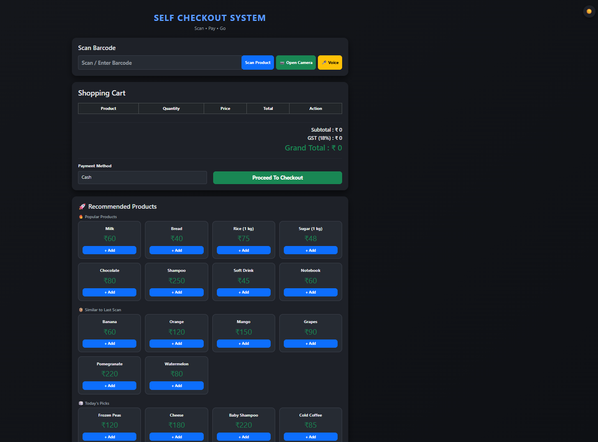
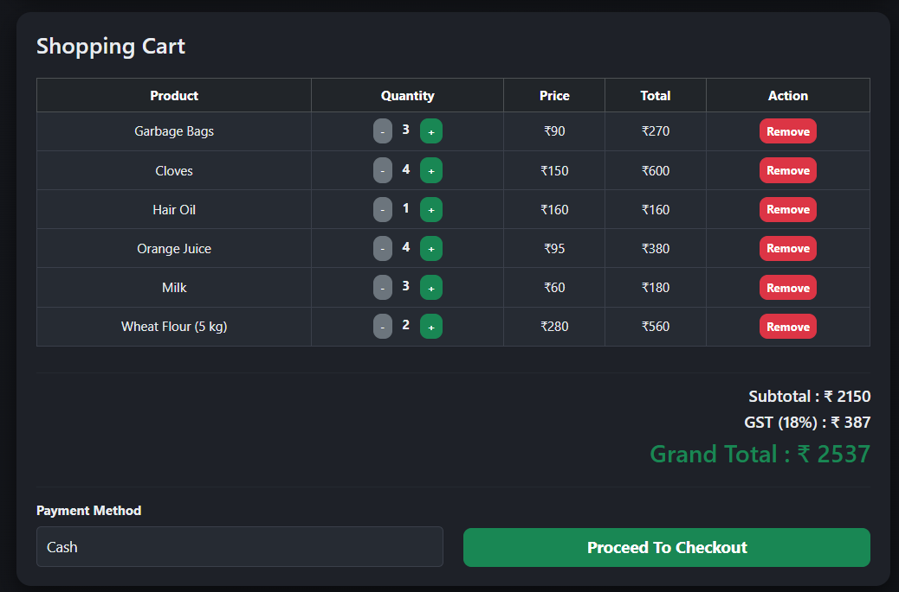
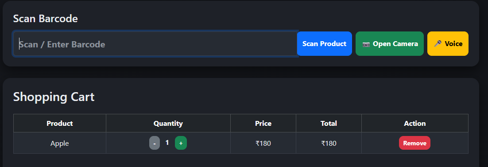
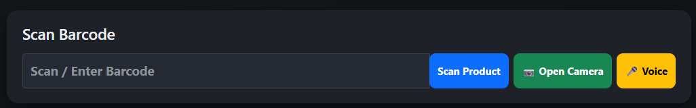
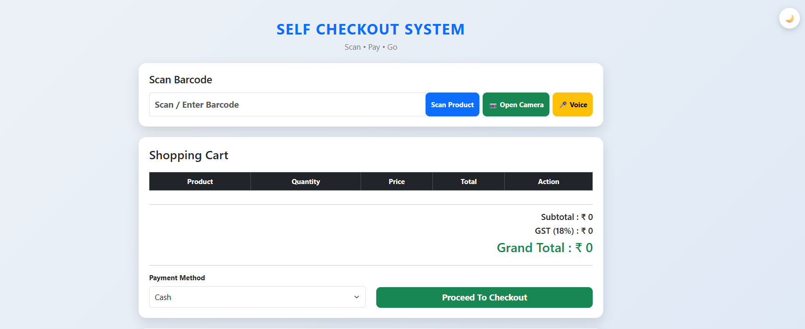
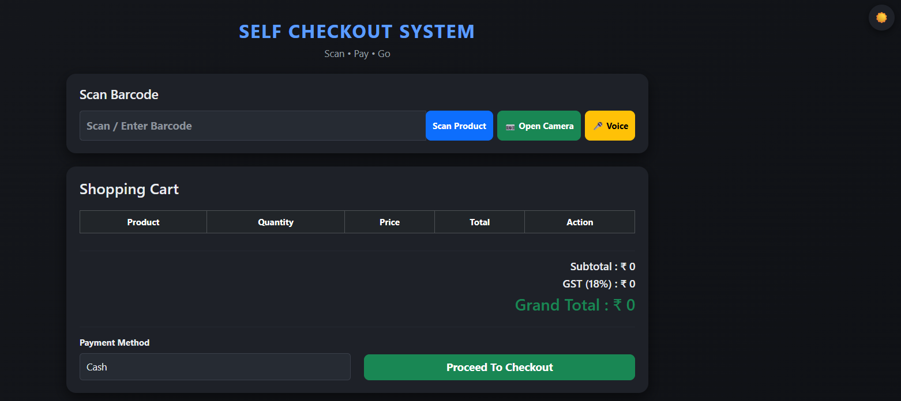
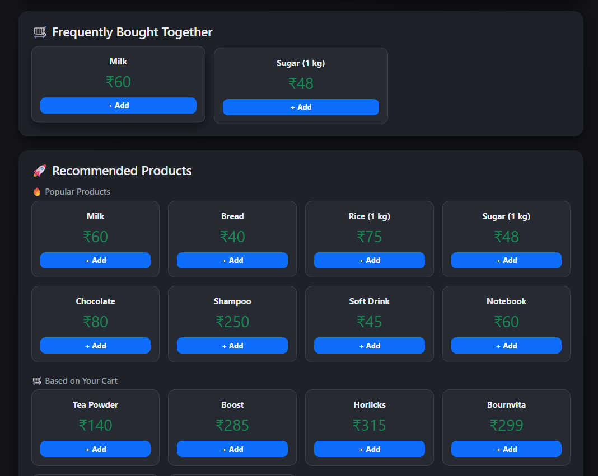
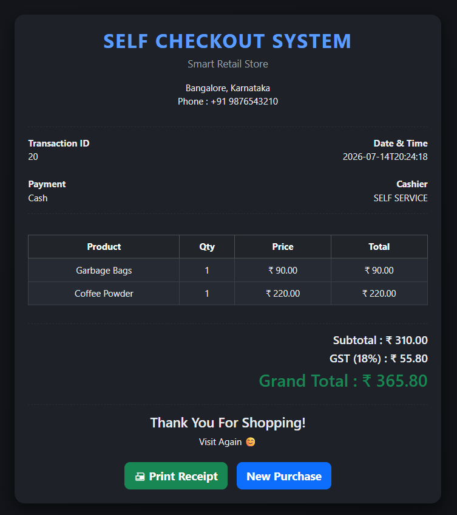

# 🛒 Self Checkout System

<p align="center">


</p>

<p align="center">
A modern <strong>Spring Boot</strong> based retail checkout application that simulates a supermarket self-checkout kiosk with barcode scanning, camera scanning, voice search, smart recommendations, and receipt generation.
</p>

---

## 📖 About

The **Self Checkout System** is a full-stack retail application developed using **Spring Boot**, **Thymeleaf**, **MySQL**, and **Bootstrap**.

It recreates a real supermarket self-checkout experience where customers can:

- 📦 Scan products using barcode or camera
- 🎤 Search products using voice commands
- 🛒 Manage their shopping cart
- 💡 Receive smart product recommendations
- 💳 Complete checkout
- 🧾 Generate and print receipts

This project demonstrates practical implementation of:

- Spring Boot MVC Architecture
- REST APIs
- Session-Based Cart Management
- Spring Data JPA
- MySQL Database Integration
- Responsive Frontend Development

---

# ✨ Features

### 🛍 Product Management

- Manual barcode scanning
- Camera barcode scanning
- Voice product search
- Smart product recommendations
- Frequently bought together suggestions
- Expanded product catalog (100+ products)
- Automatic stock management

---

### 🛒 Shopping Cart

- Add / Remove products
- Increase / Decrease quantity
- Session-based shopping cart
- Automatic subtotal calculation
- GST calculation
- Grand total calculation

---

### 💳 Checkout

- Payment processing
- Success animation
- Success sound
- Toast notifications
- Automatic transaction generation

---

### 🧾 Receipt

- Professional receipt page
- Printable receipt
- GST summary
- Transaction details
- Start new purchase

---

### 🎨 User Experience

- Responsive Bootstrap UI
- Light & Dark Mode
- Offline Bootstrap
- Offline Barcode Scanner
- Barcode Scan Beep Sound
- Clean and Modern Interface

---

# 📸 Application Preview

## 🏠 Home Page

<p align="center">

</p>

---

## 🛒 Shopping Cart

<p align="center">

</p>

---

## 📷 Barcode Scanner

<p align="center">

</p>

---

## 🎤 Voice Search

<p align="center">

</p>

---

## 🌞 Light Mode

<p align="center">

</p>

---

## 🌙 Dark Mode

<p align="center">

</p>

---

## 💡 Smart Product Recommendations

<p align="center">

</p>

---

## 🧾 Receipt

<p align="center">

</p>

---
# 🛠 Technology Stack

| Category | Technology |
|-----------|------------|
| Language | Java 17 |
| Backend | Spring Boot |
| Frontend | Thymeleaf |
| Database | MySQL |
| ORM | Spring Data JPA |
| Frontend Technologies | HTML, CSS, JavaScript |
| Styling | Bootstrap 5 |
| Build Tool | Maven |
| Barcode Scanner | html5-qrcode |
| IDE | IntelliJ IDEA |

---

# 📂 Project Structure

```text
SelfCheckoutSystem
│
├── src
│   ├── main
│   │   ├── java
│   │   │   └── com.selfcheckout
│   │   │       ├── config
│   │   │       ├── controller
│   │   │       ├── entity
│   │   │       ├── model
│   │   │       ├── repository
│   │   │       └── service
│   │   │
│   │   └── resources
│   │       ├── static
│   │       │   ├── css
│   │       │   ├── js
│   │       │   └── audio
│   │       │
│   │       └── templates
│   │           ├── checkout.html
│   │           └── receipt.html
│   │
├── images
├── pom.xml
└── README.md
```

---

# 🚀 Getting Started

## 1️⃣ Clone the Repository

```bash
git clone https://github.com/AaryanK47/self-checkout-system.git
```

---

## 2️⃣ Open in IntelliJ IDEA

Import the project as a **Maven Project**.

---

## 3️⃣ Create MySQL Database

```sql
CREATE DATABASE self_checkout_db;
```

---

## 4️⃣ Configure Database

Open

```text
src/main/resources/application.properties
```

Update your MySQL credentials:

```properties
spring.datasource.url=jdbc:mysql://localhost:3306/self_checkout_db
spring.datasource.username=root
spring.datasource.password=WRITE_YOUR_PASSWORD_HERE

spring.jpa.hibernate.ddl-auto=update
```

Replace

```
WRITE_YOUR_PASSWORD_HERE
```

with your local MySQL password.

---

## 5️⃣ Install Dependencies

```bash
mvn clean install
```

---

## 6️⃣ Run the Application

Using Maven

```bash
mvn spring-boot:run
```

OR simply run

```
SelfCheckoutSystemApplication.java
```

from IntelliJ IDEA.

---

## 7️⃣ Open the Application

```
http://localhost:8080
```

---

# 📡 REST API Endpoints

## Product

| Method | Endpoint | Description |
|---------|----------|-------------|
| GET | `/api/scan/{barcode}` | Scan Product |

---

## Shopping Cart

| Method | Endpoint |
|---------|----------|
| POST | `/api/cart/add/{id}` |
| GET | `/api/cart` |
| PUT | `/api/cart/increase/{id}` |
| PUT | `/api/cart/decrease/{id}` |
| DELETE | `/api/cart/remove/{id}` |

---

## Checkout

| Method | Endpoint |
|---------|----------|
| POST | `/api/payment/checkout` |

---

## Receipt

| Method | Endpoint |
|---------|----------|
| GET | `/receipt/{transactionId}` |

---

# ⭐ Project Highlights

- 📷 Camera Barcode Scanner
- 🎤 Voice Product Search
- 💡 Smart Product Recommendations
- 🛍 Frequently Bought Together
- 🌙 Dark Mode
- 🔔 Toast Notifications
- 📦 Inventory Management
- 🧾 Printable Receipt
- 💳 Checkout Workflow
- 📱 Responsive UI
- ⚡ Spring Boot MVC Architecture
---

# 🤝 Contributors

This project was built through collaborative development using GitHub.

| Contributor | Role |
|-------------|------|
| **Aaryan Kumar** | Project Owner • Backend Development • Database Design • Spring Boot Architecture • REST APIs • Shopping Cart • Checkout Workflow • Documentation |
| **Ankith** | UI Enhancements • Dark Mode • Voice Search • Smart Recommendations • Frequently Bought Together • Toast Notifications |

---

# 🚀 Future Enhancements

Some features planned for future releases:

- 🔐 User Authentication & Login
- 📜 Transaction History
- 📊 Admin Dashboard
- 💳 Online Payment Gateway Integration
- 📱 QR Code Payment
- 📦 Inventory Analytics
- 📄 PDF Receipt Download
- 🐳 Docker Deployment
- 🧪 Unit Testing (JUnit & Mockito)
- 📘 Swagger / OpenAPI Documentation

---

# 💼 Skills Demonstrated

This project demonstrates practical experience with:

- Java 17
- Spring Boot MVC
- Spring Data JPA
- REST API Development
- MySQL
- Thymeleaf
- Bootstrap 5
- HTML, CSS & JavaScript
- Session Management
- CRUD Operations
- MVC Architecture
- Git & GitHub Collaboration
- Maven
- Responsive UI Design

---

# 🎯 Learning Outcomes

Through this project I gained hands-on experience in:

- Building full-stack Java applications
- Designing layered architecture
- Developing RESTful APIs
- Database integration using JPA
- Managing user sessions
- Building responsive web interfaces
- Version control using Git & GitHub
- Collaborative development using Pull Requests

---

# 🌟 Why This Project?

This project was developed to simulate a **real-world supermarket self-checkout kiosk**.

Instead of creating a basic CRUD application, the focus was on implementing practical retail features such as:

- Barcode-based product scanning
- Camera barcode scanning
- Voice-enabled product search
- Smart shopping recommendations
- Shopping cart management
- Receipt generation
- Modern responsive UI
- Dark Mode support

The project follows a clean MVC architecture and demonstrates full-stack Java web development using Spring Boot.

---

# 👨‍💻 Author

## Aaryan Kumar

🎓 Computer Science Student

💻 Passionate about Java, Spring Boot, Full Stack Development & Problem Solving.

### Connect with me

- GitHub: https://github.com/AaryanK47
- LinkedIn: https://www.linkedin.com/in/aaryan-kumar-631884297/

---

# ⭐ Support

If you found this project useful, consider giving it a **⭐ Star** on GitHub.

It helps support the project and motivates future improvements.

---

<p align="center">

### Thank you for visiting! 🚀

Made with ❤️ using **Spring Boot**, **Thymeleaf**, **MySQL**, and **Bootstrap**

</p>